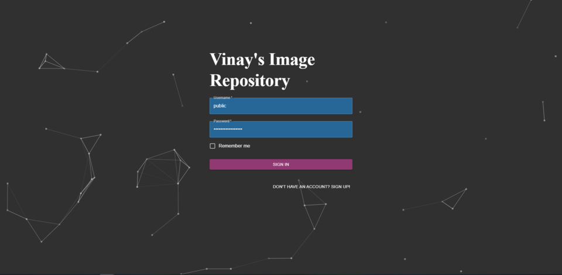

# Vinay Image Repository App

## Webapp

The web application can be found: https://vimage-repo.herokuapp.com/

**Public Test Account:**
* user: **public**
* password: **publicaccount123!**

**Mongodb atlas (Free Tier) only accounts for *512 MB*: Please dont upload a massive amount of images, Thank you!**

Table of Contents
---
- [Features](#features)
- [Application Demo](#application-demo)
- [Architecture](#architecture)
- [Getting Started](#getting-started)
  - [App Prerequisites](#app-prerequisites)
  - [Installation](#installation)
  - [Run in Development Mode Locally](#run-in-development-mode-locally)
  - [Run in Production Mode Locally](#run-in-production-mode-locally)
  - [Mongodb Atlas Integration](#mongodb-atlas-integration)
- [Deployment](#deployment)

## Features

* Private Image Repository
    * Upload images (Single or Multiple)
    * Delete images (Single or Multiple)
    * Download images (Single or Multiple)
    * Sort images by name, type, upload date
    * Set image privacy
        * Public: can be found in the public images and be viewed/downloaded by any user
        * Private: Only available to you
    * Bulk image privacy change, download, delete
    * Image preview
    * Image search

* Public Image Repository
    * Search images
    * Infinite scrolling images
    * Preview Image and view full image
    * Download image

* Authentication and Authorization
    * Secure user authentication and authorization using JWT
    * private images secure in database
    * private routing 

* Various Image Support:
    * png
    * jpg
    * jpeg
    * gif
    * jfif
    * svg
    * pjp
    * pjpeg

## Application Demo

## Video/Usage
Demo/Usage video can be found [here](https://youtu.be/Bwwq5muAKVc)

### Screenshots
  

## Architecture

### Frontend:
* React
* Material UI
* Node

### Backend:
* Flask
* MongoDB

### Hosting Services
* MongoDB Atlas
* Heroku

## Getting Started

### App Prerequisites

* Linux or Unix distribution

### Installation

1. run `source run bootstrap`

### Run in Development Mode Locally
In development mode, both react and flask will be running seperatly in development mode.
It will create and use a local mongodb.

1. run `source run dev server` in root directory
2. run `source run dev client` in root directory

### Run in Production Mode Locally
In production mode, react is built and served from the flask back end. Flask will also be running on production mode.
It will create and use a local mongodb.

1. run `source run prod` in root directory

### Mongodb Atlas Integration
If you would like to use a cloud database instead of running your database locally, follow these instructions.
1. Create a mongodb atlas account. Free tier works as well
2. Once you log in, create a cluster
3. Open the "connect" dialog and create a MongoDB User step of the dialog, enter a Username and a Password for your database user. 
5. Open the "connect" dialog and then "connect to your application" option. Now set the driver as python and version as 3.4. Then modify and save the connection-string/URI somehere as per instructions.
6. If your running locally, on your system `export MONGO_URI=<Mongodb uri. NOT mongodb+srv uri>`

Full instructions can be found [here](https://docs.atlas.mongodb.com/getting-started/)
## Deployment

Follow these instructions if you want to deploy this on heroku.

1. Fork this repo
2. Make a heroku account if you don't already have one. This project works with free tier accounts as well.
3. "Create new app" in the heroku dashboard or heroku CLI.
4. [Setup mongodb atlas](#mongodb-atlas-integration)
5. Go to your app settings in heroku dashboard, and under settings, set these 2 config vars:
  * FLASK_ENV=production
  * MONGO_URI=<Mongodb uri. NOT mongodb+srv uri>
  * COOKIE_PROD=production
6. Follow [these instructions](https://devcenter.heroku.com/articles/github-integration#enabling-github-integration) to integrate with your forked repo:
